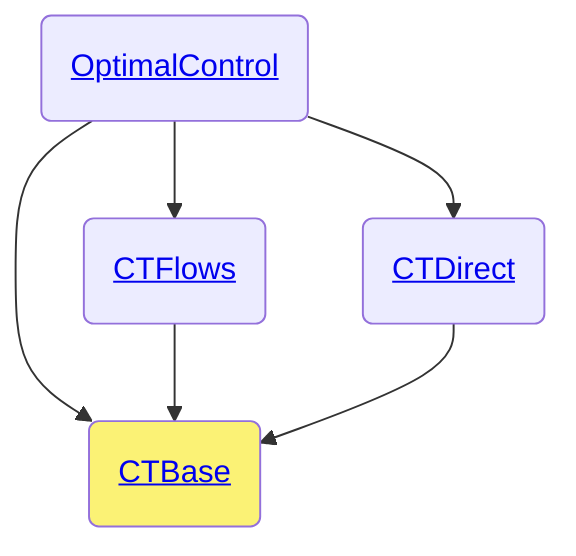

# CTBase.jl

```@meta
CurrentModule =  CTBase
```

The `CTBase.jl` package is part of the [control-toolbox ecosystem](https://github.com/control-toolbox).



For the developers, here are the [private methods](@ref dev-ctflows).
